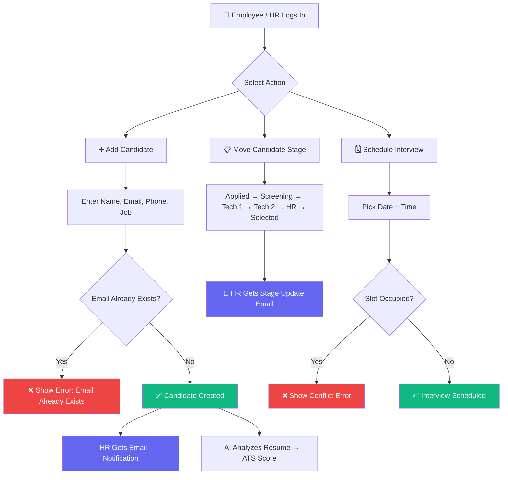
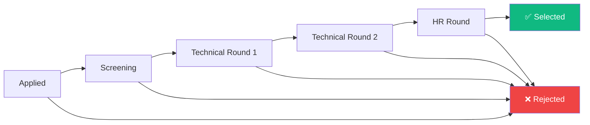

# HireFlow ATS — Applicant Tracking System

> **Live Demo:** [https://hireflow-ats.vercel.app](https://hireflow-ats.vercel.app)

A full-stack recruitment management system built with the **MERN Stack** (MongoDB, Express.js, React, Node.js). HireFlow enables HR teams and employees to collaboratively manage candidates through a structured hiring pipeline with **AI-powered resume analysis**, **automated email notifications**, and a **Kanban pipeline view**.

---

## 🔗 Links

| Resource | URL |
|----------|-----|
| **Frontend (Vercel)** | [hireflow-ats.vercel.app](https://hireflow-ats.vercel.app) |
| **Backend API (Render)** | [hireflow-ats-api.onrender.com](https://hireflow-ats-api.onrender.com) |
| **GitHub Repo** | [github.com/krithikananth/hireflow-ats](https://github.com/krithikananth/hireflow-ats) |

---

## ✨ Key Features

- **Role-Based Access** — HR and Employee roles with isolated data views
- **Candidate Management** — Add, edit, delete candidates with **duplicate email prevention**
- **Kanban Pipeline** — Visual pipeline board (Applied → Screening → Tech Rounds → HR → Selected/Rejected)
- **Interview Scheduling** — Schedule rounds with **date & time**, auto-blocks occupied slots
- **ATS Resume Checker** — Gemini AI scores resumes (1-10) against job descriptions
- **Email Notifications** — HR receives emails on new candidates and stage changes (via Resend API)
- **Dark Mode** — Toggle with persistence
- **CSV Export** — Export candidate data
- **HR Isolation** — Each HR only sees their assigned candidates
- **Admin Panel** — View all users, online status, roles

---

## 🔄 How It Works



---

## 👥 Role-Based Access

| Feature | HR | Employee |
|---------|:--:|:--------:|
| Dashboard & Stats | ✅ | ❌ |
| Manage Candidates | ✅ (assigned only) | ✅ (add only) |
| Move Pipeline Stages | ✅ (forward only) | ❌ |
| Schedule Interview Rounds | ✅ | ❌ |
| See Occupied Interview Slots | ✅ | ✅ |
| Jobs Management | ✅ | ❌ |
| Pipeline Kanban Board | ✅ | ❌ |
| Admin Panel | ✅ | ❌ |
| See HR Online Status | ❌ | ✅ |
| CSV Export | ✅ | ❌ |
| Dark Mode | ✅ | ✅ |

---

## 🔄 Candidate Lifecycle



> **Rule:** HR can only move candidates **forward** — no going back. Rejection is available at any stage.

---

## 🚀 Quick Start

### Prerequisites
- **Node.js** 18+ → [download](https://nodejs.org/)
- **MongoDB Atlas** account → [signup](https://cloud.mongodb.com/)
- **Resend** account → [signup](https://resend.com/signup) (free: 100 emails/day)
- **Google Gemini API Key** → [get key](https://aistudio.google.com/apikey) (free tier)

### 1. Clone & Install

```bash
git clone https://github.com/krithikananth/hireflow-ats.git
cd hireflow-ats

# Backend
cd server && npm install

# Frontend
cd ../client && npm install
```

### 2. Environment Variables

Create `server/.env`:

```env
PORT=5000
MONGO_URI=mongodb+srv://<user>:<pass>@cluster.mongodb.net/hireflow-ats?retryWrites=true&w=majority
JWT_SECRET=your_jwt_secret_key
CLIENT_URL=http://localhost:5173
NODE_ENV=development

# Email (Resend - free 100 emails/day)
RESEND_API_KEY=re_your_resend_api_key

# AI Resume Checker (supports multiple comma-separated keys)
GEMINI_API_KEY=your_gemini_api_key
```

For production frontend (Vercel), set:
```env
VITE_API_URL=https://your-backend.onrender.com
```

### 3. Run Locally

```bash
# Terminal 1 — Backend
cd server && npm run dev

# Terminal 2 — Frontend
cd client && npm run dev
```

Open **http://localhost:5173**

### 4. Seed Database (Optional)

```bash
cd server && node seed.js
```

---

## ☁️ Deployment

### Backend → [Render](https://render.com/)

1. Create **Web Service** → connect GitHub repo
2. **Root Directory**: `server`
3. **Build**: `npm install` | **Start**: `node server.js`
4. Add environment variables:

| Key | Value |
|-----|-------|
| `MONGO_URI` | MongoDB Atlas connection string |
| `JWT_SECRET` | Strong random secret |
| `CLIENT_URL` | `https://your-app.vercel.app` |
| `NODE_ENV` | `production` |
| `RESEND_API_KEY` | Resend API key |
| `GEMINI_API_KEY` | Gemini API key(s) |

### Frontend → [Vercel](https://vercel.com/)

1. Import GitHub repo → **Root Directory**: `client`
2. Add env: `VITE_API_URL = https://your-backend.onrender.com`
3. Deploy

---

## 📧 Email Notifications

Uses **[Resend](https://resend.com/)** HTTP API (no SMTP issues on any host).

| Trigger | Who Gets Email | Content |
|---------|---------------|---------|
| New candidate added | Assigned HR | Candidate details, job title, who added |
| Stage changed | Assigned HR | Candidate name, new stage, job title |

**Setup:** Sign up at [resend.com](https://resend.com/signup) → Create API key → Add `RESEND_API_KEY` to env

---

## 🤖 AI Resume Checker

- Upload PDF resume → Gemini AI analyzes against job description
- Returns **ATS Score (1-10)** with detailed feedback
- Supports **multi-key rotation** for higher throughput

**Setup:** Get key from [Google AI Studio](https://aistudio.google.com/apikey) → Add `GEMINI_API_KEY` to env

---

## 🗓️ Interview Scheduling

- HR schedules interview rounds with **date + time**
- System **blocks double-booking** — occupied slots show an error
- Both HR and Employee can see occupied interview slots
- Each round tracks: name, interviewer, score (0-10), date, time, feedback

---

## 📡 API Endpoints

### Auth
| Method | Endpoint | Description |
|--------|----------|-------------|
| POST | `/api/auth/signup` | Register user |
| POST | `/api/auth/login` | Login → JWT token |
| GET | `/api/auth/me` | Current user |

### Candidates
| Method | Endpoint | Description |
|--------|----------|-------------|
| GET | `/api/candidates` | List (role-filtered) |
| POST | `/api/candidates` | Add (duplicate email blocked) |
| PUT | `/api/candidates/:id` | Update |
| PUT | `/api/candidates/:id/stage` | Move stage (HR, forward only) |
| DELETE | `/api/candidates/:id` | Delete (HR) |

### Interviews
| Method | Endpoint | Description |
|--------|----------|-------------|
| GET | `/api/interviews/schedule/occupied` | Get occupied slots (all roles) |
| GET | `/api/interviews/:candidateId` | Get rounds for candidate (HR) |
| POST | `/api/interviews` | Add round (time conflict check) |
| PUT | `/api/interviews/:id` | Update round |
| DELETE | `/api/interviews/:id` | Delete round (HR) |

### Jobs, Dashboard, Users
| Method | Endpoint | Description |
|--------|----------|-------------|
| GET/POST | `/api/jobs` | List / Create jobs |
| GET | `/api/dashboard/stats` | HR dashboard stats |
| GET | `/api/dashboard/pipeline` | Pipeline counts |
| GET | `/api/users/hr` | HR list + online status |
| GET | `/api/users/admin` | Admin panel data |

---

## 🛠️ Tech Stack

| Layer | Technology |
|-------|-----------|
| Frontend | React 19, Vite, CSS3 (dark mode), React Router v7, Lucide Icons |
| Backend | Node.js, Express.js, Mongoose, JWT, bcryptjs |
| Database | MongoDB Atlas |
| AI | Google Gemini API |
| Email | Resend HTTP API |
| Hosting | Vercel (frontend) + Render (backend) |

---

## 📝 License

MIT License — feel free to use and modify.

---

## 👨‍💻 Author

**Krithik Ananth K A**  
[GitHub](https://github.com/krithikananth) • [LinkedIn](https://linkedin.com/in/krithikananth)
