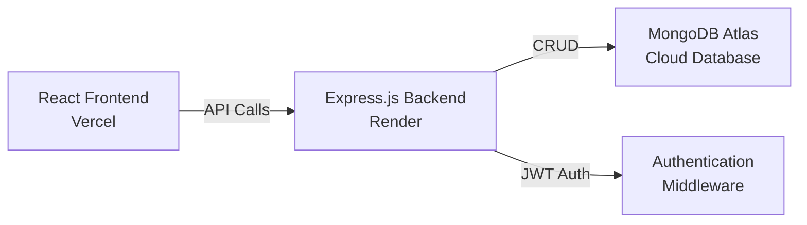
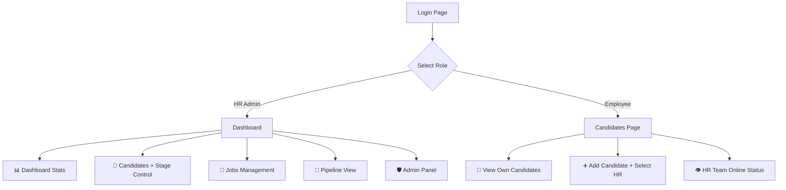
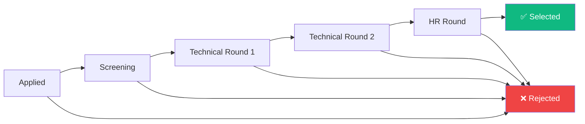
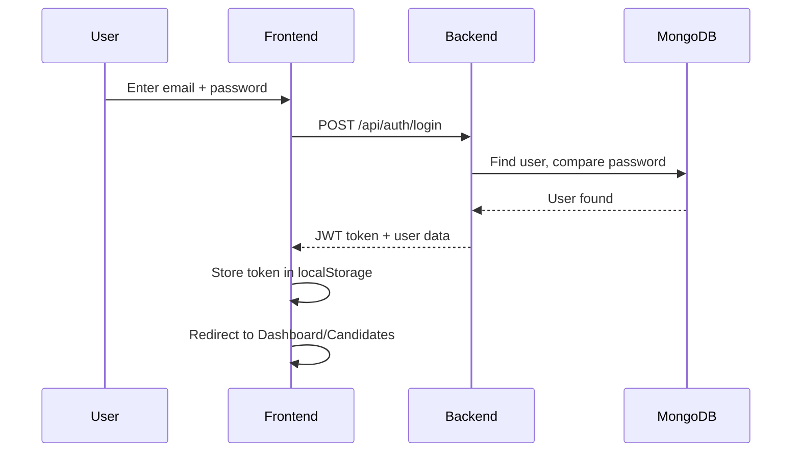
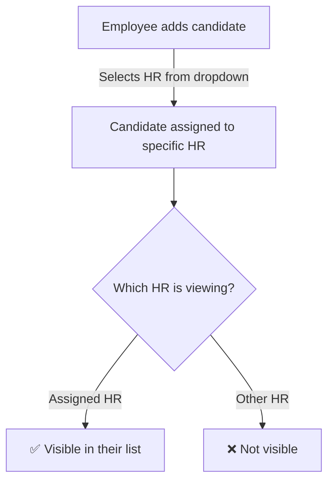

# HireFlow ATS — Applicant Tracking System

> **Live Demo:** [https://hireflow-ats.vercel.app](https://hireflow-ats.vercel.app)

A full-stack recruitment management system built with the **MERN Stack** (MongoDB, Express.js, React, Node.js). HireFlow enables HR teams and employees to collaboratively manage candidates through a structured hiring pipeline.

---

## 🔗 Links

| Resource | URL |
|----------|-----|
| **Frontend (Vercel)** | [hireflow-ats.vercel.app](https://hireflow-ats.vercel.app) |
| **Backend API (Render)** | [hireflow-ats-api.onrender.com](https://hireflow-ats-api.onrender.com) |
| **GitHub Repo** | [github.com/krithikananth/hireflow-ats](https://github.com/krithikananth/hireflow-ats) |

---

## 🏗️ System Architecture



---

## 👥 Role-Based Access



| Feature | HR | Employee |
|---------|:--:|:--------:|
| Dashboard & Stats | ✅ | ❌ |
| Manage Candidates | ✅ (own assigned) | ✅ (add only) |
| Move Pipeline Stages | ✅ (forward only) | ❌ |
| View Interview Rounds | ✅ | ❌ |
| Jobs Management | ✅ | ❌ |
| Pipeline Kanban | ✅ | ❌ |
| Admin Panel | ✅ | ❌ |
| See HR Online Status | ❌ | ✅ |
| Select HR for Candidate | ❌ | ✅ |

---

## 🔄 Candidate Lifecycle



> **Rule:** HR can only move candidates **forward** — no going back to previous stages. Rejection is available at any stage.

---

## 📁 Project Structure

```
HireFlow-ATS/
├── client/                    # React Frontend
│   └── src/
│       ├── components/        # Reusable UI (Sidebar, Modal, Layout, Loader)
│       ├── context/           # AuthContext (login/signup/logout)
│       ├── pages/             # LoginPage, Dashboard, Candidates, Jobs, Pipeline, Admin
│       └── utils/             # API config, constants, stage colors
│
├── server/                    # Express.js Backend
│   ├── config/db.js           # MongoDB connection with retry logic
│   ├── controllers/           # Auth, Candidate, Job, Dashboard, Interview logic
│   ├── middleware/auth.js     # JWT verification + online tracking
│   ├── models/                # User, Candidate, Job, InterviewRound schemas
│   ├── routes/                # Auth, Candidate, Job, Dashboard, Interview, User routes
│   └── server.js              # Express server entry point
│
└── README.md
```

---

## 🔐 Authentication Flow



---

## 🛡️ HR Isolation



- Each HR **only sees candidates assigned to them**
- Even if the same person applies for 2 roles under different HRs, each HR only sees their own
- Employees see **only candidates they added** (basic info only — no stage/pipeline)

---

## 🚀 Quick Start

### Prerequisites
- Node.js 18+
- MongoDB Atlas account (or local MongoDB)

### 1. Clone & Install

```bash
git clone https://github.com/krithikananth/hireflow-ats.git
cd hireflow-ats

# Install backend
cd server && npm install

# Install frontend
cd ../client && npm install
```

### 2. Environment Variables

**Server** (`server/.env`):
```env
MONGO_URI=mongodb+srv://<user>:<pass>@cluster.mongodb.net/hireflow-ats
JWT_SECRET=your_secret_key
CLIENT_URL=http://localhost:5173
PORT=5000
```

**Client** (Vercel env or `.env`):
```env
VITE_API_URL=http://localhost:5000
```

### 3. Run Locally

```bash
# Terminal 1 — Backend
cd server && npm run dev

# Terminal 2 — Frontend
cd client && npm run dev
```

Open **http://localhost:5173**

---

## 📡 API Endpoints

| Method | Endpoint | Access | Description |
|--------|----------|--------|-------------|
| POST | `/api/auth/signup` | Public | Register user |
| POST | `/api/auth/login` | Public | Login user |
| GET | `/api/auth/me` | Auth | Get current user |
| GET | `/api/candidates` | Auth | List candidates (role-filtered) |
| POST | `/api/candidates` | Auth | Add candidate (duplicate email blocked) |
| PUT | `/api/candidates/:id` | Auth | Update candidate |
| PUT | `/api/candidates/:id/stage` | Auth | Move candidate stage (forward only) |
| DELETE | `/api/candidates/:id` | HR | Delete candidate |
| GET | `/api/jobs` | Auth | List jobs (deduplicated for Employee) |
| POST | `/api/jobs` | HR | Create job |
| GET | `/api/dashboard/stats` | HR | Dashboard stats |
| GET | `/api/dashboard/pipeline` | HR | Pipeline summary |
| GET | `/api/users/hr` | Auth | List all HRs with online status |
| GET | `/api/users/admin` | HR | Admin panel — all users |

---

## 🛠️ Tech Stack

| Layer | Technology |
|-------|-----------|
| Frontend | React 19, Vite, Tailwind CSS v4, React Router, Lucide Icons |
| Backend | Node.js, Express.js, Mongoose, JWT, bcrypt |
| Database | MongoDB Atlas |
| Hosting | Vercel (frontend), Render (backend) |

---

## 📊 Admin Panel

HR users can access the **Admin Panel** from the sidebar to view:
- Total users, online count, HR/Employee breakdown
- Each user's name, email, role, company ID
- 🟢 Online / ⚫ Offline status (active in last 5 minutes)
- Last active timestamp and join date

**Database check** (terminal):
```bash
cd server && node admin-check.js
```

---

## 📝 License

MIT License — feel free to use and modify.
