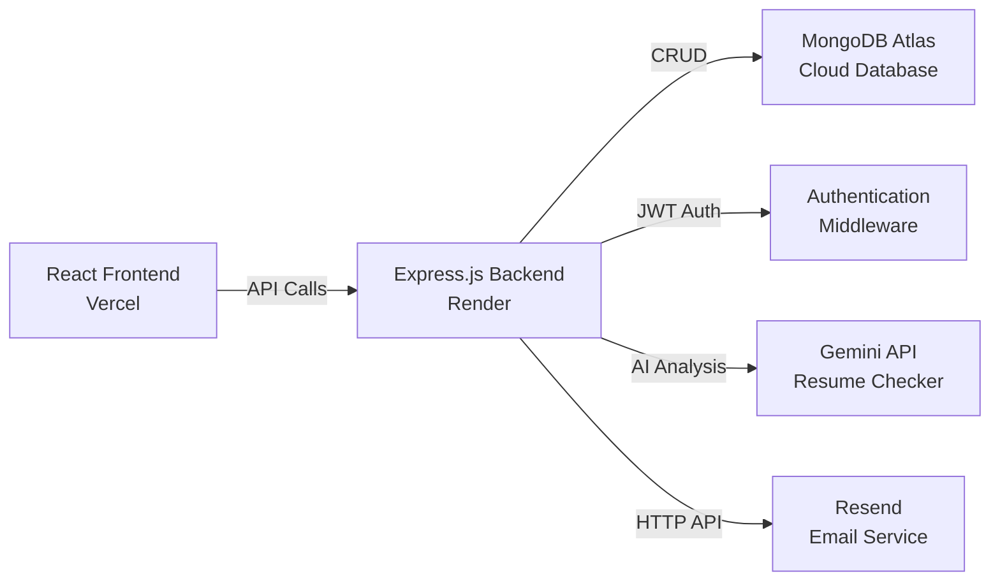
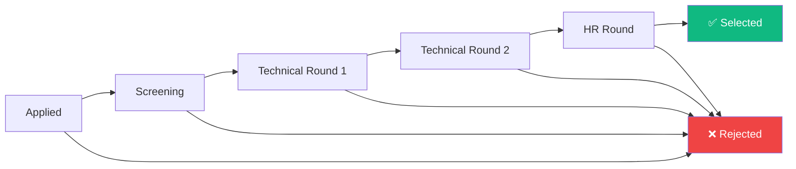
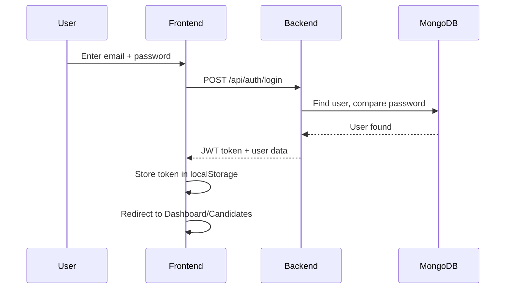
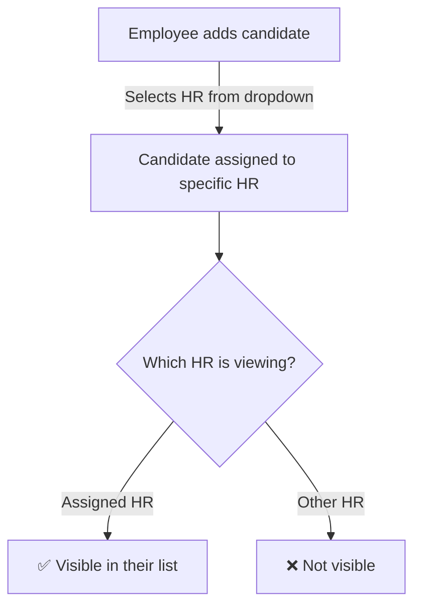

# HireFlow ATS — Applicant Tracking System

> **Live Demo:** [https://hireflow-ats.vercel.app](https://hireflow-ats.vercel.app)

A full-stack recruitment management system built with the **MERN Stack** (MongoDB, Express.js, React, Node.js). HireFlow enables HR teams and employees to collaboratively manage candidates through a structured hiring pipeline with **AI-powered resume analysis**, **automated email notifications**, and a **Kanban pipeline view**.

---

## 🔗 Links

| Resource | URL |
|----------|-----|
| **Frontend (Vercel)** | [hireflow-ats.vercel.app](https://hireflow-ats.vercel.app) |
| **Backend API (Render)** | [hireflow-ats-api.onrender.com](https://hireflow-ats-api.onrender.com) |
| **GitHub Repo** | [github.com/krithikananth/hireflow-ats](https://github.com/krithikananth/hireflow-ats) |

---

## ✨ Key Features

### 🎯 Core Recruitment
- **Role-Based Access** — HR and Employee roles with isolated data views
- **Candidate Management** — Add, edit, delete, and track candidates through hiring stages
- **Kanban Pipeline** — Visual drag-and-drop pipeline board (Applied → Screening → Tech Rounds → HR → Selected/Rejected)
- **Interview Round Tracking** — Log multiple interview rounds with scores and feedback per candidate
- **HR Isolation** — Each HR only sees candidates assigned to them

### 🤖 AI-Powered Features
- **ATS Resume Checker** — Gemini AI analyzes uploaded resumes against job descriptions, providing a compatibility score (1-10) with detailed feedback
- **Multi-Key API Rotation** — Supports multiple Gemini API keys for higher throughput

### 📧 Email Notifications (Resend API)
- **New Candidate Added** → HR receives assignment notification email
- **Stage Changed** → Both candidate and assigned HR receive notification emails
- **Personalized Content** — Emails include candidate names, HR contact names, job titles, and stage-specific messages (congratulations for selections, etc.)

### 🎨 UI/UX
- **Dark Mode** — Toggle with localStorage persistence
- **CSV Export** — Export filtered candidate data as CSV
- **Responsive Design** — Works on desktop and mobile
- **Real-time HR Status** — Employees can see which HR users are online

---

## 🏗️ System Architecture



---

## 👥 Role-Based Access

| Feature | HR | Employee |
|---------|:--:|:--------:|
| Dashboard & Stats | ✅ | ❌ |
| Manage Candidates | ✅ (own assigned) | ✅ (add only) |
| Move Pipeline Stages | ✅ (forward only) | ❌ |
| View Interview Rounds | ✅ | ❌ |
| Jobs Management | ✅ | ❌ |
| Pipeline Kanban | ✅ | ❌ |
| Admin Panel | ✅ | ❌ |
| See HR Online Status | ❌ | ✅ |
| Select HR for Candidate | ❌ | ✅ |
| CSV Export | ✅ | ❌ |
| Dark Mode | ✅ | ✅ |

---

## 🔄 Candidate Lifecycle



> **Rule:** HR can only move candidates **forward** — no going back to previous stages. Rejection is available at any stage.

---

## 📁 Project Structure

```
HireFlow-ATS/
├── client/                         # React Frontend (Vite)
│   └── src/
│       ├── components/             # Reusable UI Components
│       │   ├── Layout.jsx          # App shell with sidebar
│       │   ├── Sidebar.jsx         # Navigation + dark mode toggle
│       │   ├── ProtectedRoute.jsx  # Auth guard for routes
│       │   └── Loader.jsx          # Loading spinner
│       ├── context/
│       │   └── AuthContext.jsx     # Auth state (login/signup/logout)
│       ├── pages/
│       │   ├── LoginPage.jsx       # Login & Signup forms
│       │   ├── DashboardPage.jsx   # HR dashboard with stats
│       │   ├── CandidatesPage.jsx  # Candidate list + CRUD + CSV export
│       │   ├── JobsPage.jsx        # Job management
│       │   ├── PipelinePage.jsx    # Kanban board view
│       │   └── AdminPage.jsx       # User management panel
│       ├── utils/
│       │   ├── api.js              # Axios instance with interceptors
│       │   └── constants.js        # Stage names, colors, mappings
│       ├── index.css               # Global styles + dark mode variables
│       ├── App.jsx                 # Router configuration
│       └── main.jsx                # Entry point
│
├── server/                         # Express.js Backend
│   ├── config/
│   │   └── db.js                   # MongoDB connection with retry logic
│   ├── controllers/
│   │   ├── authController.js       # Signup, Login, GetMe
│   │   ├── candidateController.js  # CRUD + stage update + email triggers
│   │   ├── dashboardController.js  # Stats aggregation
│   │   ├── interviewController.js  # Interview round management
│   │   └── jobController.js        # Job CRUD
│   ├── middleware/
│   │   └── auth.js                 # JWT verification + online tracking
│   ├── models/
│   │   ├── User.js                 # User schema (HR/Employee roles)
│   │   ├── Candidate.js            # Candidate schema + pipeline stages
│   │   ├── Job.js                  # Job schema
│   │   └── InterviewRound.js       # Interview round schema
│   ├── routes/
│   │   ├── authRoutes.js           # /api/auth/*
│   │   ├── candidateRoutes.js      # /api/candidates/*
│   │   ├── dashboardRoutes.js      # /api/dashboard/*
│   │   ├── interviewRoutes.js      # /api/interviews/*
│   │   ├── jobRoutes.js            # /api/jobs/*
│   │   └── userRoutes.js           # /api/users/*
│   ├── services/
│   │   ├── emailService.js         # Resend HTTP API email notifications
│   │   └── resumeChecker.js        # Gemini AI resume analysis
│   ├── server.js                   # Express server entry point
│   ├── seed.js                     # Database seeder script
│   └── package.json
│
└── README.md
```

---

## 🚀 Quick Start

### Prerequisites
- **Node.js** 18+ ([download](https://nodejs.org/))
- **MongoDB Atlas** account ([signup](https://cloud.mongodb.com/)) — or local MongoDB
- **Resend** account ([signup](https://resend.com/signup)) — for email notifications (free: 100 emails/day)
- **Google Gemini API Key** ([get key](https://aistudio.google.com/apikey)) — for AI resume analysis (free tier available)

### 1. Clone & Install

```bash
git clone https://github.com/krithikananth/hireflow-ats.git
cd hireflow-ats

# Install backend dependencies
cd server && npm install

# Install frontend dependencies
cd ../client && npm install
```

### 2. Environment Variables

#### Server (`server/.env`)

Create a `.env` file in the `server/` directory:

```env
# Required
PORT=5000
MONGO_URI=mongodb+srv://<user>:<pass>@cluster.mongodb.net/hireflow-ats?retryWrites=true&w=majority
JWT_SECRET=your_jwt_secret_key_here
CLIENT_URL=http://localhost:5173
NODE_ENV=development

# Email Notifications (Resend - free 100 emails/day)
RESEND_API_KEY=re_your_resend_api_key_here

# AI Resume Checker (Gemini - supports comma-separated multiple keys)
GEMINI_API_KEY=AIzaSy_your_key_here
```

#### Client (Vercel env or `client/.env`)

For local development, the client connects to `http://localhost:5000` by default.  
For production (Vercel), set this environment variable:

```env
VITE_API_URL=https://your-backend-url.onrender.com
```

### 3. Seed the Database (Optional)

```bash
cd server
node seed.js
```

This creates sample HR users, employees, jobs, and candidates for testing.

### 4. Run Locally

```bash
# Terminal 1 — Start Backend
cd server && npm run dev

# Terminal 2 — Start Frontend
cd client && npm run dev
```

Open **http://localhost:5173** in your browser.

### 5. Default Login Credentials

After running `seed.js`:

| Role | Email | Password |
|------|-------|----------|
| HR | From seed output | `1234567` |
| Employee | From seed output | `1234567` |

Or create your own account via the **Signup** page.

---

## ☁️ Deployment Guide

### Backend (Render)

1. Create a new **Web Service** on [Render](https://render.com/)
2. Connect your GitHub repo → select the `server/` directory
3. Set **Build Command**: `npm install`
4. Set **Start Command**: `node server.js`
5. Add **Environment Variables**:

   | Key | Value |
   |-----|-------|
   | `MONGO_URI` | Your MongoDB Atlas connection string |
   | `JWT_SECRET` | A strong random secret |
   | `CLIENT_URL` | `https://your-app.vercel.app` |
   | `NODE_ENV` | `production` |
   | `RESEND_API_KEY` | Your Resend API key |
   | `GEMINI_API_KEY` | Your Gemini API key(s), comma-separated |

6. Click **Deploy**

### Frontend (Vercel)

1. Import your GitHub repo on [Vercel](https://vercel.com/)
2. Set **Root Directory**: `client`
3. Add **Environment Variable**:
   ```
   VITE_API_URL = https://your-backend.onrender.com
   ```
4. Click **Deploy**

---

## 📧 Email Notification System

HireFlow uses **[Resend](https://resend.com/)** (HTTP API) for reliable email delivery. No SMTP port issues.

### How It Works

| Trigger | Who Gets Email | Email Content |
|---------|---------------|---------------|
| New candidate added | Assigned HR | Candidate details, job title, who added them |
| Candidate moves to new stage | Assigned HR | Candidate name, new stage, job title |
| Candidate moves to new stage | Candidate* | Congratulations message, stage info, HR contact name |

> *\*Candidate emails require Resend domain verification on the free plan. HR emails work immediately.*

### Setup

1. Sign up at [resend.com](https://resend.com/signup) (free — 100 emails/day)
2. Go to **API Keys** → Create a key
3. Add `RESEND_API_KEY` to your `.env` and Render environment

### For Sending to Any Email (Optional)

To send emails to candidate email addresses (not just the account owner):
1. Go to [Resend Domains](https://resend.com/domains)
2. Add and verify your custom domain
3. Update the `from` address in `server/services/emailService.js`

---

## 🤖 AI Resume Checker

HireFlow analyzes uploaded resumes against job descriptions using **Google Gemini AI**.

### How It Works

1. Candidate uploads a PDF resume during profile creation
2. Backend extracts text from the PDF using `pdf-parse`
3. Resume text + job description are sent to Gemini API
4. Gemini returns a **compatibility score (1-10)** with detailed feedback
5. Results are displayed as an "ATS Score" badge on the candidate card

### Setup

1. Get a Gemini API key from [Google AI Studio](https://aistudio.google.com/apikey)
2. Add to `.env`: `GEMINI_API_KEY=your_key_here`
3. For higher throughput, use multiple comma-separated keys:
   ```
   GEMINI_API_KEY=key1,key2,key3
   ```

---

## 📡 API Endpoints

### Authentication
| Method | Endpoint | Access | Description |
|--------|----------|--------|-------------|
| POST | `/api/auth/signup` | Public | Register a new user |
| POST | `/api/auth/login` | Public | Login and get JWT token |
| GET | `/api/auth/me` | Auth | Get current logged-in user |

### Candidates
| Method | Endpoint | Access | Description |
|--------|----------|--------|-------------|
| GET | `/api/candidates` | Auth | List candidates (role-filtered) |
| POST | `/api/candidates` | Auth | Add candidate (with optional resume PDF) |
| PUT | `/api/candidates/:id` | Auth | Update candidate details |
| PUT | `/api/candidates/:id/stage` | HR | Move candidate to next stage |
| DELETE | `/api/candidates/:id` | HR | Delete candidate |

### Jobs
| Method | Endpoint | Access | Description |
|--------|----------|--------|-------------|
| GET | `/api/jobs` | Auth | List jobs (deduplicated for Employee view) |
| POST | `/api/jobs` | HR | Create a new job |
| PUT | `/api/jobs/:id` | HR | Update job details |
| DELETE | `/api/jobs/:id` | HR | Delete a job |

### Dashboard & Pipeline
| Method | Endpoint | Access | Description |
|--------|----------|--------|-------------|
| GET | `/api/dashboard/stats` | HR | Get dashboard statistics |
| GET | `/api/dashboard/pipeline` | HR | Get pipeline stage counts |

### Interviews
| Method | Endpoint | Access | Description |
|--------|----------|--------|-------------|
| GET | `/api/interviews/:candidateId` | HR | Get interview rounds for a candidate |
| POST | `/api/interviews` | HR | Add an interview round |

### Users
| Method | Endpoint | Access | Description |
|--------|----------|--------|-------------|
| GET | `/api/users/hr` | Auth | List all HR users with online status |
| GET | `/api/users/admin` | HR | Admin panel — all users with details |

---

## 🛠️ Tech Stack

| Layer | Technology |
|-------|-----------|
| Frontend | React 19, Vite, CSS3 (with dark mode), React Router v7, Lucide Icons |
| Backend | Node.js, Express.js, Mongoose, JWT, bcryptjs |
| Database | MongoDB Atlas |
| AI | Google Gemini API (resume analysis) |
| Email | Resend HTTP API |
| Hosting | Vercel (frontend), Render (backend) |

---

## 🔐 Authentication Flow



---

## 🛡️ HR Isolation



- Each HR **only sees candidates assigned to them**
- Employees see **only candidates they added** (basic info, no stage/pipeline access)
- Email notifications go **only to the assigned HR**, never to all HRs

---

## 📊 Admin Panel

HR users can access the **Admin Panel** from the sidebar to view:
- Total users, online count, HR/Employee breakdown
- Each user's name, email, role, company ID
- 🟢 Online / ⚫ Offline status (active in last 5 minutes)
- Last active timestamp and join date

---

## 🌙 Dark Mode

Toggle dark mode from the sidebar (Moon/Sun icon). Theme preference is saved in `localStorage` and persists across sessions.

---

## 📝 License

MIT License — feel free to use and modify.

---

## 👨‍💻 Author

**Krithik Ananth K A**  
[GitHub](https://github.com/krithikananth) • [LinkedIn](https://linkedin.com/in/krithikananth)
